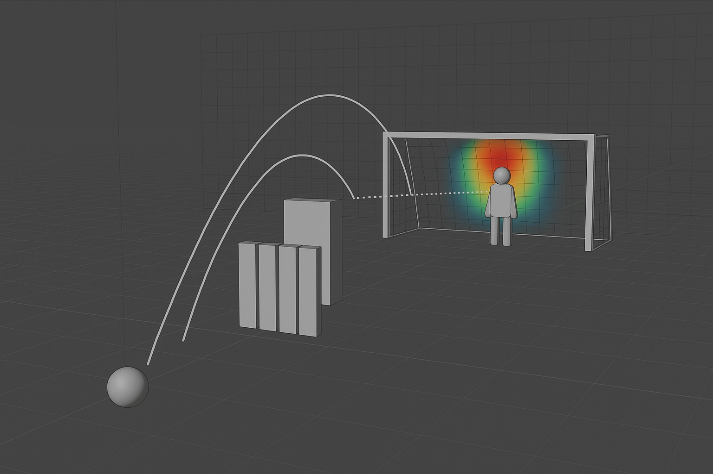

# Free-Kick Simulator

A simulation framework to analyze free-kick scenarios in football, with a focus on visibility, reaction time, and decision-making from the goalkeeper’s perspective. This project combines physical simulation, ray tracing, and analytics to provide actionable insights for training and strategy.



## 🧠 Project Team
- Yuqi Yang  
- Anthony Rodrigues  
- André Glatzl  

## 🎯 Objectives

1. **Simulate Free-Kick Scenarios**
   - Model a free-kick setup with ball trajectories, a static wall (slab) and a goal.

2. **Ray Tracing for Visibility**
   - Implement ray tracing to determine when the ball becomes visible past the defensive wall.
   - Compute visibility angles and timestamps to estimate goalkeeper reaction time.

4. **Analytics & Probability Estimation**
   - Use all collected data to predict with some probability where the ball might land with the help of bayesian inference.
   - Update the prior after every visible ball movement from goalie's perspective.
   - Provide feedback that can guide training drills or tactical decisions.

## 📁 Project Structure
```
Free-kick-simulator/
├── 01_KickSimulator/ # Ball trajectory and physics modeling
├── 02_Raytracing/ # Visibility computation from goalkeeper's POV
├── 03_Analytics/ # Statistical and probability-based analysis
├── .git/ # Git tracking
├── .gitattributes # Git configuration
```

## 🛠️ Technologies Used

- Python / C++ (TBD depending on performance needs)
- Ray Tracing Algorithms (Custom / Library-Based)
- NumPy, Matplotlib (for data handling and visualization)
## 📊 Sample Use Case

1. Input a ball trajectory and wall setup.
2. Run the simulation
2. Run ray tracing as post-processing to determine when the goalkeeper sees the ball.
3. Estimate if the goalkeeper has enough time to reach the predicted landing position.

## 🚀 Future Extensions

- Add goalkeeper AI decision tree or neural net.
- Integrate wind or spin effects.
- Expand simulation to include dynamic wall movement.

## 📄 License

MIT License – Free to use with attribution.

## 📬 Contact

Feel free to reach out for collaborations or feedback!
